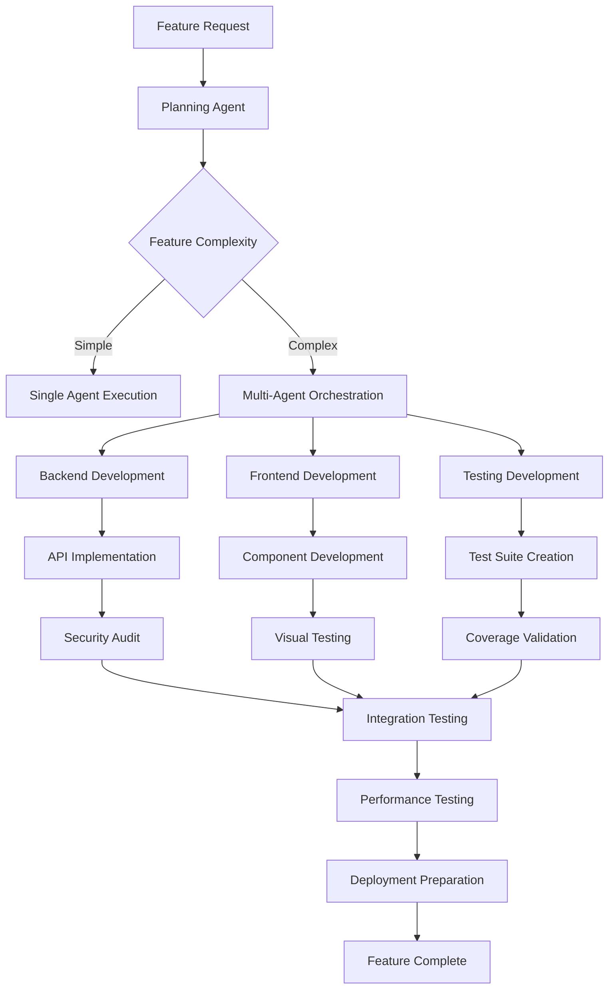

# Multi-Agent Workflow Coordination Patterns

## Purpose
Comprehensive patterns for coordinating multiple specialized agents in complex feature development workflows, ensuring seamless handoffs, maintaining context continuity, and optimizing development velocity while following ClarosFarm's hydroponic system requirements.

## 🚨 CRITICAL: Agent Orchestration Philosophy

### Core Coordination Principles
- ✅ **Context Continuity**: Agent handoffs preserve full context and requirements
- ✅ **Specialized Expertise**: Each agent handles their domain of expertise
- ✅ **Parallel Execution**: Independent agents work concurrently where possible
- ✅ **Quality Gates**: Each agent validates previous work before proceeding
- ✅ **Farm-Centric Design**: All agents understand multi-tenant hydroponic requirements
- ✅ **Automated Handoffs**: Seamless transitions with minimal human intervention

## Agent Ecosystem Overview

### Primary Development Agents
```typescript
interface AgentEcosystem {
  // Core Development Agents
  "full-stack-feature": {
    role: "End-to-end feature development",
    expertise: ["FastAPI", "React", "Database", "Testing"],
    coordinates_with: ["backend-developer", "frontend-developer", "testing-master"]
  },
  
  "backend-developer": {
    role: "API and service development", 
    expertise: ["FastAPI", "SQLAlchemy", "Security", "Performance"],
    coordinates_with: ["security-auditor", "testing-master"]
  },
  
  "frontend-developer": {
    role: "React UI development",
    expertise: ["React", "TypeScript", "Responsive Design", "State Management"],
    coordinates_with: ["react-component-factory", "dashboard-widget-builder"]
  },
  
  // Specialized Domain Agents
  "greenhouse-manager": {
    role: "Hydroponic system management",
    expertise: ["Climate Control", "Sensor Integration", "Automation"],
    coordinates_with: ["sensor-monitor", "irrigation-controller"]
  },
  
  "testing-master": {
    role: "Comprehensive testing orchestration",
    expertise: ["Test Strategy", "Coverage Validation", "CI/CD Integration"],
    coordinates_with: ["testing-orchestrator", "visual-regression-tester"]
  }
}
```

## Complex Feature Development Workflows

### Full-Stack Feature Development Pipeline


### Agent Coordination Patterns

#### Pattern 1: Sequential Handoff Chain
```typescript
// Sequential development with context preservation
class SequentialWorkflow {
  async executeFeatureDevelopment(requirements: FeatureRequirements) {
    const workflowContext: WorkflowContext = {
      feature: requirements,
      farmRequirements: await this.extractFarmRequirements(requirements),
      qualityGates: [],
      artifacts: new Map(),
      crossCuttingConcerns: {
        security: [],
        performance: [],
        testing: []
      }
    };
    
    // Phase 1: Architecture & Planning
    const architectureResult = await this.executeAgent('backend-developer', {
      task: 'design_api_architecture',
      context: workflowContext,
      deliverables: ['api_design', 'database_schema', 'security_model']
    });
    
    workflowContext.artifacts.set('architecture', architectureResult);
    
    // Phase 2: Backend Implementation
    const backendResult = await this.executeAgent('backend-developer', {
      task: 'implement_apis',
      context: workflowContext,
      requirements: [
        'implement all API endpoints',
        'ensure 100% test coverage',
        'include farm isolation security',
        'optimize for greenhouse environment'
      ]
    });
    
    workflowContext.artifacts.set('backend', backendResult);
    
    // Phase 3: Frontend Implementation (can run parallel)
    const frontendResult = await this.executeAgent('frontend-developer', {
      task: 'implement_ui_components',
      context: workflowContext,
      requirements: [
        'mobile-first responsive design',
        'touch-friendly for greenhouse use',
        'real-time sensor data display',
        'offline capability support'
      ]
    });
    
    workflowContext.artifacts.set('frontend', frontendResult);
    
    // Phase 4: Integration & Testing
    const testingResult = await this.executeAgent('testing-master', {
      task: 'comprehensive_testing',
      context: workflowContext,
      requirements: [
        'API coverage 100%',
        'multi-tenant isolation tests',
        'mobile responsiveness tests',
        'greenhouse environment simulation'
      ]
    });
    
    return this.validateFeatureCompletion(workflowContext);
  }
}
```

#### Pattern 2: Parallel Execution with Synchronization Points
```typescript
// Parallel agent execution for maximum efficiency
class ParallelWorkflow {
  async executeComplexFeature(requirements: ComplexFeature) {
    const workflowContext = await this.initializeContext(requirements);
    
    // Parallel Phase 1: Independent Development
    const [backendTask, frontendTask, testingTask] = await Promise.allSettled([
      this.executeAgent('backend-developer', {
        task: 'implement_sensor_api',
        context: workflowContext,
        focus: 'api_layer'
      }),
      
      this.executeAgent('frontend-developer', {
        task: 'implement_sensor_dashboard', 
        context: workflowContext,
        focus: 'ui_layer'
      }),
      
      this.executeAgent('testing-master', {
        task: 'prepare_test_framework',
        context: workflowContext,
        focus: 'test_infrastructure'
      })
    ]);
    
    // Synchronization Point: Validate Parallel Results
    await this.validateParallelResults([backendTask, frontendTask, testingTask]);
    
    // Phase 2: Integration Activities
    const integrationResult = await this.executeIntegrationPhase(workflowContext);
    
    return integrationResult;
  }
  
  private async validateParallelResults(results: PromiseSettledResult<any>[]) {
    const failures = results.filter(r => r.status === 'rejected');
    if (failures.length > 0) {
      // Implement retry logic or error handling
      await this.handleParallelFailures(failures);
    }
  }
}
```

#### Pattern 3: Domain-Specific Orchestration
```typescript
// Hydroponic system feature development
class HydroponicFeatureWorkflow {
  async implementIrrigationFeature(requirements: IrrigationFeatureSpec) {
    // Domain-specific agent coordination
    const workflow = new DomainWorkflow('hydroponic-management');
    
    // Step 1: Irrigation Controller Agent
    const controllerResult = await workflow.execute('irrigation-controller', {
      task: 'design_irrigation_system',
      requirements: {
        zones: requirements.zones,
        schedules: requirements.schedules,
        sensors: requirements.sensorIntegration,
        safetyConstraints: requirements.safety
      }
    });
    
    // Step 2: Sensor Integration (parallel)
    const sensorResult = await workflow.execute('sensor-monitor', {
      task: 'integrate_moisture_sensors',
      dependencies: controllerResult,
      requirements: {
        sensorTypes: ['soil_moisture', 'water_level', 'flow_rate'],
        alertThresholds: requirements.alerting,
        dataLogging: requirements.analytics
      }
    });
    
    // Step 3: Backend API Development
    const apiResult = await workflow.execute('backend-developer', {
      task: 'implement_irrigation_apis',
      context: {
        controller: controllerResult,
        sensors: sensorResult
      },
      requirements: [
        'RESTful irrigation control endpoints',
        'Real-time sensor data streaming',
        'Schedule management CRUD operations',
        'Emergency shutoff capabilities'
      ]
    });
    
    // Step 4: Greenhouse Manager Integration
    const integrationResult = await workflow.execute('greenhouse-manager', {
      task: 'integrate_irrigation_system',
      dependencies: [controllerResult, sensorResult, apiResult],
      requirements: {
        climateIntegration: true,
        automationRules: requirements.automation,
        reportingDashboard: true
      }
    });
    
    return integrationResult;
  }
}
```

## Context Preservation Patterns

### Workflow Context Management
```typescript
interface WorkflowContext {
  // Feature Specifications
  feature: {
    id: string;
    name: string;
    description: string;
    acceptanceCriteria: string[];
    businessValue: string;
  };
  
  // Farm-Specific Requirements
  farmContext: {
    systemType: 'hydroponic' | 'aeroponic' | 'aquaponic';
    scale: 'small' | 'medium' | 'large' | 'commercial';
    environment: 'greenhouse' | 'outdoor' | 'indoor';
    climateZone: string;
    automationLevel: 'manual' | 'semi-auto' | 'fully-auto';
  };
  
  // Technical Context
  technical: {
    apiVersion: string;
    compatibility: string[];
    performanceRequirements: PerformanceSpec;
    securityRequirements: SecuritySpec;
  };
  
  // Agent Results
  artifacts: Map<string, AgentResult>;
  
  // Quality Gates
  qualityGates: QualityGate[];
  
  // Cross-Cutting Concerns
  crossCuttingConcerns: {
    security: SecurityRequirement[];
    performance: PerformanceRequirement[];
    testing: TestingRequirement[];
    accessibility: AccessibilityRequirement[];
  };
}

class ContextPreservationManager {
  async handoffToAgent(
    fromAgent: string,
    toAgent: string, 
    context: WorkflowContext,
    specificInstructions: AgentInstructions
  ): Promise<AgentResult> {
    
    // Validate context completeness
    await this.validateContextCompleteness(context, toAgent);
    
    // Create agent-specific context
    const agentContext = await this.createAgentContext(
      context, 
      toAgent, 
      specificInstructions
    );
    
    // Execute agent with full context
    const result = await this.executeAgent(toAgent, {
      context: agentContext,
      instructions: specificInstructions,
      qualityGates: this.getRelevantQualityGates(toAgent, context),
      handoffNotes: await this.generateHandoffNotes(fromAgent, toAgent, context)
    });
    
    // Update workflow context with results
    context.artifacts.set(toAgent, result);
    
    return result;
  }
  
  private async generateHandoffNotes(
    fromAgent: string,
    toAgent: string,
    context: WorkflowContext
  ): Promise<HandoffNotes> {
    return {
      previousWork: context.artifacts.get(fromAgent),
      keyDecisions: await this.extractKeyDecisions(context),
      constraintsAndLimitations: await this.identifyConstraints(context),
      expectationsForNextAgent: await this.generateExpectations(toAgent, context),
      criticalConsiderations: await this.identifyCriticalPoints(context)
    };
  }
}
```

### Agent Capability Matching
```typescript
class AgentCapabilityMatcher {
  private agentCapabilities = new Map([
    ['backend-developer', {
      strengths: ['API Design', 'Database Design', 'Security Implementation'],
      farmSpecific: ['Multi-tenant Architecture', 'Sensor Data Processing'],
      limitations: ['Frontend Development', 'Mobile Optimization'],
      outputFormats: ['FastAPI Code', 'Database Schemas', 'API Documentation']
    }],
    ['frontend-developer', {
      strengths: ['React Development', 'Responsive Design', 'State Management'],
      farmSpecific: ['Greenhouse UI/UX', 'Mobile-First Design', 'Real-time Data Display'],
      limitations: ['Backend Logic', 'Database Design'],
      outputFormats: ['React Components', 'CSS/SCSS', 'TypeScript Interfaces']
    }],
    ['greenhouse-manager', {
      strengths: ['Climate Control', 'Automation Logic', 'Sensor Integration'],
      farmSpecific: ['Hydroponic Systems', 'Environmental Controls', 'Growth Optimization'],
      limitations: ['Generic Web Development', 'Non-agriculture Domains'],
      outputFormats: ['Control Logic', 'Sensor Configurations', 'Automation Rules']
    }]
  ]);
  
  selectOptimalAgent(task: TaskRequirements): AgentSelection {
    const scores = new Map();
    
    for (const [agentName, capabilities] of this.agentCapabilities) {
      const score = this.calculateTaskFitScore(task, capabilities);
      scores.set(agentName, score);
    }
    
    const bestAgent = Array.from(scores.entries())
      .sort(([,a], [,b]) => b - a)[0];
    
    return {
      primaryAgent: bestAgent[0],
      confidenceScore: bestAgent[1],
      supportingAgents: this.identifySupportingAgents(task, bestAgent[0]),
      reasoning: this.generateSelectionReasoning(task, bestAgent[0])
    };
  }
}
```

## Quality Gate Coordination

### Multi-Agent Quality Validation
```typescript
class QualityGateOrchestrator {
  async validateFeatureQuality(
    context: WorkflowContext,
    completedArtifacts: Map<string, AgentResult>
  ): Promise<QualityValidationResult> {
    
    const qualityChecks = [
      // Code Quality Gates
      {
        gate: 'code-quality',
        agents: ['security-auditor', 'testing-master'],
        criteria: [
          'Zero security vulnerabilities',
          '100% API test coverage',
          'Performance benchmarks met',
          'Code complexity within limits'
        ]
      },
      
      // Farm-Specific Quality Gates
      {
        gate: 'farm-compatibility',
        agents: ['greenhouse-manager', 'sensor-monitor'],
        criteria: [
          'Multi-tenant isolation verified',
          'Greenhouse environment compatibility',
          'Sensor integration validated',
          'Mobile usability confirmed'
        ]
      },
      
      // Integration Quality Gates
      {
        gate: 'integration-quality',
        agents: ['full-stack-feature', 'testing-orchestrator'],
        criteria: [
          'End-to-end user flows working',
          'Real-time data synchronization',
          'Offline capability functional',
          'Performance under load validated'
        ]
      }
    ];
    
    const results = [];
    
    for (const qualityCheck of qualityChecks) {
      const checkResult = await this.executeQualityGate(
        qualityCheck,
        context,
        completedArtifacts
      );
      results.push(checkResult);
    }
    
    return this.consolidateQualityResults(results);
  }
  
  private async executeQualityGate(
    gate: QualityGate,
    context: WorkflowContext,
    artifacts: Map<string, AgentResult>
  ): Promise<QualityGateResult> {
    
    const gateResults = await Promise.allSettled(
      gate.agents.map(agent => this.executeAgent(agent, {
        task: `validate_${gate.gate}`,
        context: context,
        artifacts: artifacts,
        criteria: gate.criteria
      }))
    );
    
    return {
      gateName: gate.gate,
      passed: gateResults.every(r => r.status === 'fulfilled' && r.value.passed),
      details: gateResults,
      recommendations: await this.generateQualityRecommendations(gate, gateResults)
    };
  }
}
```

## Error Handling and Recovery

### Agent Failure Recovery Patterns
```typescript
class WorkflowRecoveryManager {
  async handleAgentFailure(
    failedAgent: string,
    error: AgentError,
    context: WorkflowContext
  ): Promise<RecoveryResult> {
    
    const recoveryStrategies = [
      // Strategy 1: Retry with enhanced context
      {
        name: 'enhanced-retry',
        applicable: error.type === 'context-insufficient',
        action: async () => {
          const enhancedContext = await this.enhanceContext(context, failedAgent);
          return this.retryAgent(failedAgent, enhancedContext);
        }
      },
      
      // Strategy 2: Alternative agent selection
      {
        name: 'alternative-agent',
        applicable: error.type === 'capability-mismatch',
        action: async () => {
          const alternativeAgent = await this.selectAlternativeAgent(
            failedAgent, 
            context.currentTask
          );
          return this.executeAgent(alternativeAgent, context);
        }
      },
      
      // Strategy 3: Task decomposition
      {
        name: 'task-decomposition',
        applicable: error.type === 'task-complexity',
        action: async () => {
          const subtasks = await this.decomposeTask(context.currentTask);
          return this.executeSubtasks(subtasks, context);
        }
      },
      
      // Strategy 4: Human intervention
      {
        name: 'human-escalation',
        applicable: error.severity === 'critical',
        action: async () => {
          return this.escalateToHuman(failedAgent, error, context);
        }
      }
    ];
    
    const applicableStrategies = recoveryStrategies.filter(s => s.applicable);
    
    for (const strategy of applicableStrategies) {
      try {
        const result = await strategy.action();
        if (result.success) {
          return {
            recovered: true,
            strategy: strategy.name,
            result: result,
            context: await this.updateContextAfterRecovery(context, result)
          };
        }
      } catch (recoveryError) {
        console.warn(`Recovery strategy ${strategy.name} failed:`, recoveryError);
      }
    }
    
    // All recovery strategies failed
    return {
      recovered: false,
      error: error,
      recommendedAction: 'manual-intervention-required'
    };
  }
}
```

## Performance Optimization

### Agent Execution Optimization
```typescript
class WorkflowPerformanceOptimizer {
  async optimizeAgentExecution(workflow: WorkflowPlan): Promise<OptimizedWorkflow> {
    // Analyze dependencies and identify parallel execution opportunities
    const dependencyGraph = this.buildDependencyGraph(workflow);
    const parallelGroups = this.identifyParallelExecutionGroups(dependencyGraph);
    
    // Resource allocation optimization
    const resourceRequirements = this.calculateResourceRequirements(workflow);
    const optimizedSchedule = this.optimizeResourceScheduling(
      parallelGroups, 
      resourceRequirements
    );
    
    // Caching opportunities
    const cachingStrategy = this.identifyCachingOpportunities(workflow);
    
    return {
      executionPlan: optimizedSchedule,
      parallelGroups: parallelGroups,
      caching: cachingStrategy,
      estimatedDuration: this.estimateExecutionTime(optimizedSchedule),
      resourceUtilization: this.calculateResourceEfficiency(optimizedSchedule)
    };
  }
  
  private identifyParallelExecutionGroups(
    dependencyGraph: DependencyGraph
  ): ParallelGroup[] {
    const groups = [];
    const visited = new Set();
    
    for (const task of dependencyGraph.tasks) {
      if (!visited.has(task.id)) {
        const parallelTasks = this.findIndependentTasks(task, dependencyGraph);
        if (parallelTasks.length > 1) {
          groups.push({
            tasks: parallelTasks,
            estimatedTime: Math.max(...parallelTasks.map(t => t.estimatedDuration)),
            resourceRequirement: this.sumResourceRequirements(parallelTasks)
          });
        }
        parallelTasks.forEach(t => visited.add(t.id));
      }
    }
    
    return groups;
  }
}
```

## Monitoring and Observability

### Workflow Monitoring Dashboard
```typescript
class WorkflowMonitor {
  private metrics = new Map();
  
  async trackWorkflowExecution(workflow: WorkflowExecution) {
    const monitor = {
      workflowId: workflow.id,
      startTime: new Date(),
      currentPhase: 'initialization',
      agents: new Map(),
      metrics: {
        totalDuration: 0,
        agentExecutionTimes: new Map(),
        qualityGateResults: [],
        errorCount: 0,
        recoveryAttempts: 0
      }
    };
    
    workflow.on('agent-started', (agent, task) => {
      monitor.agents.set(agent, {
        status: 'running',
        startTime: new Date(),
        task: task
      });
    });
    
    workflow.on('agent-completed', (agent, result) => {
      const agentInfo = monitor.agents.get(agent);
      agentInfo.status = 'completed';
      agentInfo.endTime = new Date();
      agentInfo.duration = agentInfo.endTime - agentInfo.startTime;
      agentInfo.result = result;
      
      monitor.metrics.agentExecutionTimes.set(agent, agentInfo.duration);
    });
    
    workflow.on('quality-gate-executed', (gate, result) => {
      monitor.metrics.qualityGateResults.push({
        gate: gate.name,
        passed: result.passed,
        timestamp: new Date(),
        details: result.details
      });
    });
    
    workflow.on('error', (error, context) => {
      monitor.metrics.errorCount++;
      this.logWorkflowError(workflow.id, error, context);
    });
    
    return monitor;
  }
  
  async generateWorkflowReport(workflowId: string): Promise<WorkflowReport> {
    const monitor = this.monitors.get(workflowId);
    
    return {
      summary: {
        workflowId: workflowId,
        totalDuration: monitor.metrics.totalDuration,
        success: monitor.metrics.errorCount === 0,
        agentsUsed: monitor.agents.size
      },
      
      performance: {
        agentPerformance: Array.from(monitor.metrics.agentExecutionTimes.entries()),
        bottlenecks: this.identifyBottlenecks(monitor),
        parallelizationEfficiency: this.calculateParallelizationEfficiency(monitor)
      },
      
      quality: {
        qualityGateResults: monitor.metrics.qualityGateResults,
        overallQualityScore: this.calculateQualityScore(monitor.metrics.qualityGateResults)
      },
      
      recommendations: this.generateOptimizationRecommendations(monitor)
    };
  }
}
```

## Best Practices Summary

### DO's
- ✅ Preserve full context across agent handoffs
- ✅ Use specialized agents for their domain expertise
- ✅ Implement comprehensive quality gates
- ✅ Design for parallel execution where possible
- ✅ Include farm-specific requirements in all workflows
- ✅ Monitor workflow performance and bottlenecks
- ✅ Implement robust error recovery strategies
- ✅ Validate agent capability matching before execution

### DON'Ts
- ❌ Don't lose context during agent transitions
- ❌ Don't use generic agents for specialized tasks
- ❌ Don't skip quality validation between phases
- ❌ Don't ignore parallel execution opportunities
- ❌ Don't forget hydroponic system requirements
- ❌ Don't neglect workflow monitoring
- ❌ Don't abandon workflows on first failure
- ❌ Don't assign tasks without capability validation

This multi-agent workflow coordination system ensures efficient, high-quality feature development while maintaining the specific requirements of ClarosFarm's hydroponic management system through intelligent agent orchestration and comprehensive quality assurance.