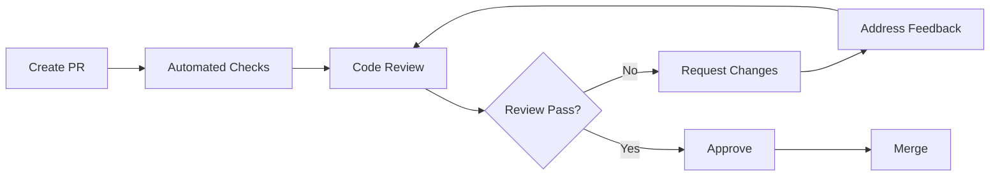

# Universal Code Review Standards

This document establishes universal code review processes, quality gates, and collaboration practices that must be followed across all software development projects. These standards provide the foundation for consistent, high-quality code reviews regardless of project specifics.

## 📦 Pull Request Guidance (Scope & Size)

- Keep PRs feature-scoped and under ~400 lines changed where possible.
- Include what/why, before/after, risks, and follow-ups.
- Update headers and READMEs.
- Link ADMs/ADRs when decisions change architecture.

## 🔍 FUNDAMENTAL CODE REVIEW PROCESS

### 1. **Review Process Framework (MANDATORY)**

#### **Core Review Requirements:**
- **Universal coverage**: Every code change must be reviewed before merge
- **Reviewer qualifications**: At least 1 qualified reviewer for standard changes
- **Complexity scaling**: 2+ reviewers for major features or architectural changes
- **Domain expertise**: Security/performance experts required for sensitive changes
- **Review completeness**: All feedback must be addressed before approval

#### **Standard Review Workflow:**


#### **Review Timeline Standards:**
- **Critical changes**: 24 hours maximum
- **Standard changes**: 48 hours maximum
- **Complex changes**: 72 hours maximum with interim feedback
- **Documentation updates**: 24 hours maximum

### 2. **Automated Quality Gates (CRITICAL)**

#### **Pre-Review Automation Pipeline:**
```yaml
# MANDATORY: Automated checks before human review
automated_quality_gates:
  code_quality:
    - static_analysis: required
    - lint_validation: required
    - type_checking: required
    - code_formatting: required
    - complexity_analysis: required
    - code_duplication: warning
  
  testing_validation:
    - unit_test_execution: required
    - integration_test_execution: required
    - code_coverage_check: required
    - test_quality_analysis: required
    - security_vulnerability_scan: required
  
  build_verification:
    - compilation_success: required
    - dependency_resolution: required
    - package_vulnerability_scan: required
    - build_artifact_validation: required
    - performance_baseline_check: warning
  
  documentation_validation:
    - api_documentation_sync: required
    - changelog_updates: required
    - readme_consistency: warning
```

#### **Universal Quality Standards:**
- **Build integrity**: All code must compile and build successfully
- **Test coverage**: Minimum 80% coverage for new code, 70% for modified code
- **Static analysis**: Zero critical issues, warnings acceptable with justification
- **Security compliance**: No high/critical security vulnerabilities
- **Performance impact**: No significant performance regressions without approval
- **Documentation sync**: API changes must include documentation updates

### 3. **Comprehensive Review Standards (MANDATORY)**

#### **Universal Review Evaluation Framework:**
```typescript
interface UniversalReviewChecklist {
  functionalCorrectness: {
    requirementsFulfillment: boolean;    // Meets specified requirements
    businessLogicAccuracy: boolean;      // Business logic correctly implemented
    edgeCaseHandling: boolean;          // Edge cases properly addressed
    errorScenarioCoverage: boolean;     // Error scenarios handled appropriately
    inputValidationCompleteness: boolean; // All inputs properly validated
  };
  
  codeQualityAssessment: {
    readabilityClarity: boolean;        // Code is clear and understandable
    maintainabilityDesign: boolean;     // Easy to modify and extend
    performanceEfficiency: boolean;     // No performance bottlenecks
    securityConsiderations: boolean;    // Security best practices followed
    testabilityStructure: boolean;      // Code structure supports testing
  };
  
  architecturalCompliance: {
    designPatternUsage: boolean;        // Appropriate design patterns used
    solidPrinciplesAdherence: boolean;  // SOLID principles followed
    layerSeparationIntegrity: boolean;  // Proper layer separation maintained
    dependencyManagement: boolean;      // Dependencies properly managed
    interfaceDesignQuality: boolean;    // Clean, well-designed interfaces
  };
  
  standardsCompliance: {
    codingStyleConsistency: boolean;    // Consistent with project style
    namingConventionAdherence: boolean; // Proper naming conventions
    documentationAdequacy: boolean;     // Sufficient documentation provided
    versionControlPractices: boolean;   // Good commit practices
    configurationManagement: boolean;   // Configuration properly handled
  };
  
  qualityAssurance: {
    testCoverageAdequacy: boolean;      // Sufficient test coverage
    testQualityAssessment: boolean;     // Tests are meaningful and robust
    integrationTestCoverage: boolean;   // Integration scenarios tested
    regressionTestConsideration: boolean; // Regression scenarios covered
    performanceTestInclusion: boolean;  // Performance impact tested
  };
}
```

### 4. **Professional Review Communication (CRITICAL)**

#### **Effective Feedback Framework:**
```typescript
// MANDATORY: Professional review communication standards

interface ReviewFeedbackStandards {
  // ✅ Exemplary review feedback approaches
  effectiveFeedback: {
    specificAndActionable: string;
    constructiveAndHelpful: string;
    educationalAndInformative: string;
    questioningWithPurpose: string;
    positiveAndEncouraging: string;
  };
  
  // ❌ Counterproductive feedback patterns to avoid
  ineffectiveFeedback: {
    vagueAndUnhelpful: string;
    negativeAndDestructive: string;
    overlandNitpicking: string;
    personalizedCriticism: string;
    overwhelmingRequests: string;
  };
}

const reviewFeedbackExamples: ReviewFeedbackStandards = {
  effectiveFeedback: {
    specificAndActionable: "Line 127: This O(n²) operation will be problematic with datasets >1000 items. Consider implementing pagination or using a more efficient algorithm like binary search.",
    constructiveAndHelpful: "This business logic could be extracted into a service class for better testability and reusability across components.",
    educationalAndInformative: "This async pattern without proper error boundaries could lead to unhandled promise rejections. Here's our error handling guide: [link]",
    questioningWithPurpose: "I notice we're implementing custom validation here. Could we leverage our existing validation library to maintain consistency?",
    positiveAndEncouraging: "Excellent use of the factory pattern here! This makes the code much more maintainable and follows our architectural guidelines perfectly."
  },
  ineffectiveFeedback: {
    vagueAndUnhelpful: "This looks wrong",
    negativeAndDestructive: "This entire approach is fundamentally flawed",
    overlandNitpicking: "Add a space after this comma",
    personalizedCriticism: "You always overcomplicate things",
    overwhelmingRequests: "Rewrite everything using different patterns"
  }
};
```

#### **Review Communication Standards:**
- **Response timeliness**: 24h for critical, 48h for standard, 72h for complex changes
- **Professional tone**: Respectful, collaborative, and constructive communication
- **Learning orientation**: Reviews as mutual learning and knowledge sharing opportunities
- **Actionable guidance**: Clear, specific, and implementable suggestions
- **Resolution commitment**: All feedback addressed before approval
- **Knowledge sharing**: Include links to documentation, examples, or learning resources
- **Balanced perspective**: Acknowledge strengths alongside improvement suggestions

### 5. **Review Approval Framework (MANDATORY)**

#### **Comprehensive Approval Criteria:**
```typescript
interface UniversalApprovalCriteria {
  functionalRequirements: {
    requirementsSatisfied: boolean;     // All specified requirements met
    functionalityValidated: boolean;    // Feature works correctly in all scenarios  
    regressionTestsPassed: boolean;     // No existing functionality broken
    integrationPointsVerified: boolean; // Integration points work correctly
    userExperienceValidated: boolean;   // UX/UI changes enhance user experience
  };
  
  qualityStandards: {
    codeQualityMaintained: boolean;     // Code quality standards met
    testSuiteComprehensive: boolean;    // Adequate test coverage and quality
    documentationComplete: boolean;     // Documentation updated appropriately
    performanceAcceptable: boolean;     // Performance impact acceptable
    securityCompliant: boolean;         // Security requirements satisfied
  };
  
  technicalCompliance: {
    architecturalConsistency: boolean;  // Follows architectural guidelines
    designPatternUsage: boolean;        // Appropriate design patterns used
    dependencyManagement: boolean;      // Dependencies properly managed
    configurationManagement: boolean;   // Configuration handled appropriately
    errorHandlingComplete: boolean;     // Error scenarios properly handled
  };
  
  processCompliance: {
    automatedChecksPass: boolean;       // All automated checks successful
    reviewFeedbackAddressed: boolean;   // All review feedback addressed
    branchingStrategyFollowed: boolean; // Proper branching strategy used
    commitQualityAcceptable: boolean;   // Commit messages and structure good
    changelogMaintained: boolean;       // Change documentation updated
  };
  
  domainSpecificRequirements: {
    businessLogicCorrect: boolean;      // Business rules implemented correctly
    dataIntegrityMaintained: boolean;   // Data consistency and integrity preserved
    accessControlValidated: boolean;    // Access controls properly implemented
    auditTrailMaintained: boolean;      // Audit and logging requirements met
    complianceRequirementsMet: boolean; // Regulatory/compliance needs satisfied
  };
}
```

#### **Approval Decision Matrix:**
- **Immediate approval**: All criteria satisfied, minor or no feedback
- **Conditional approval**: Major criteria satisfied, minor issues to address
- **Request changes**: Critical issues identified, significant rework required
- **Escalate review**: Complex issues requiring domain expert or architectural review

## 📊 REVIEW METRICS & PERFORMANCE TRACKING

### **Comprehensive Review Metrics Framework:**
```typescript
interface ReviewMetricsFramework {
  processEfficiency: {
    reviewInitiationTime: number;       // Time from PR creation to first review
    reviewCompletionTime: number;       // Time from first review to approval
    totalCycleTime: number;            // Time from PR creation to merge
    reviewIterationCount: number;       // Number of review-feedback cycles
    reviewerResponseTime: number;       // Average time for reviewer responses
    authorResponseTime: number;         // Average time for author responses
  };
  
  qualityIndicators: {
    postMergeDefectRate: number;       // Bugs found after merge per PR
    reworkPercentage: number;          // PRs requiring significant changes
    testCoverageImpact: number;        // Test coverage change per PR
    codeComplexityTrend: number;       // Complexity trend over time
    documentationCompleteness: number; // Documentation update rate
    securityIssueDetectionRate: number; // Security issues caught in review
  };
  
  collaborationMetrics: {
    reviewParticipationRate: number;   // Team members actively reviewing
    crossTeamReviewRate: number;       // Inter-team review collaboration
    mentoringInteractionRate: number;  // Senior-junior review interactions
    knowledgeSharingIndex: number;     // Knowledge sharing through reviews
    feedbackQualityScore: number;      // Quality rating of review feedback
    conflictResolutionEfficiency: number; // Speed of resolving review conflicts
  };
  
  riskAssessment: {
    criticalChangeReviewRate: number;  // Critical changes properly reviewed
    securityReviewCoverage: number;    // Security-sensitive changes reviewed
    performanceImpactAssessment: number; // Performance impact evaluated
    architecturalReviewRate: number;   // Architectural changes reviewed
    complianceValidationRate: number;  // Compliance requirements validated
  };
}
```

### **Universal Performance Standards:**
- **Review response time**: <24h critical, <48h standard, <72h complex
- **Total cycle time**: <3 days for standard PRs, <5 days for complex PRs
- **Quality threshold**: <10% post-merge defect rate, <20% major rework rate
- **Coverage standards**: 100% critical/security changes reviewed by experts
- **Participation rate**: >90% team members actively participating in reviews
- **Knowledge sharing**: >30% reviews include educational/mentoring components

## 🛡️ SECURITY REVIEW FRAMEWORK

### **Comprehensive Security Review Standards:**
```typescript
interface UniversalSecurityReviewChecklist {
  authenticationSecurity: {
    authenticationMechanisms: boolean;      // Strong authentication implemented
    sessionManagementSecurity: boolean;     // Secure session lifecycle management
    credentialHandlingSecurity: boolean;    // Secure credential storage/transmission
    tokenSecurityCompliance: boolean;       // JWT/token security best practices
    multiFactorAuthSupport: boolean;        // MFA considerations addressed
    authenticationBypassPrevention: boolean; // Authentication bypass vulnerabilities
  };
  
  inputValidationSecurity: {
    injectionAttackPrevention: boolean;     // SQL, NoSQL, command injection prevention
    crossSiteScriptingPrevention: boolean; // XSS attack prevention
    inputSanitizationCompleteness: boolean; // Comprehensive input sanitization
    parameterValidationRobustness: boolean; // Robust parameter validation
    fileUploadSecurity: boolean;           // Secure file upload handling
    dataDeserializationSecurity: boolean;  // Secure data deserialization
  };
  
  dataProtectionCompliance: {
    encryptionAtRestImplementation: boolean; // Sensitive data encryption at rest
    encryptionInTransitEnforcement: boolean; // HTTPS/TLS enforcement
    dataMinimizationPrinciples: boolean;    // Data minimization principles followed
    accessControlImplementation: boolean;   // Robust access control mechanisms
    dataClassificationCompliance: boolean;  // Data classification standards followed
    privacyByDesignCompliance: boolean;     // Privacy-by-design principles
  };
  
  systemConfigurationSecurity: {
    secretsManagementCompliance: boolean;   // No hardcoded secrets, secure storage
    securityHeadersImplementation: boolean; // Security headers properly configured
    errorHandlingSecurity: boolean;         // No sensitive information in errors
    securityLoggingCompleteness: boolean;   // Comprehensive security event logging
    dependencySecurityValidation: boolean;  // Third-party dependency security validation
    configurationHardening: boolean;        // System configuration hardening
  };
  
  runtimeSecurityConsiderations: {
    secureCodeExecutionPrevention: boolean; // Prevent arbitrary code execution
    privilegeEscalationPrevention: boolean; // Privilege escalation prevention
    raceConditionMitigation: boolean;       // Race condition security implications
    secureResourceManagement: boolean;      // Secure resource allocation/cleanup
    sidechannelAttackMitigation: boolean;   // Side-channel attack considerations
    businessLogicFlawPrevention: boolean;   // Business logic security flaws
  };
}
```

## 🚀 PERFORMANCE REVIEW FRAMEWORK

### **Comprehensive Performance Review Standards:**
```typescript
interface UniversalPerformanceReviewChecklist {
  algorithmicEfficiency: {
    timeComplexityAnalysis: string;         // Big O time complexity documented and justified
    spaceComplexityAnalysis: string;        // Memory usage complexity analyzed
    algorithmOptimizationLevel: boolean;    // Algorithms optimized for expected usage patterns
    scalabilityAssessment: boolean;         // Scalability with data and user growth assessed
    dataStructureOptimization: boolean;     // Optimal data structures chosen
    concurrencyConsiderations: boolean;     // Concurrent execution impact analyzed
  };
  
  dataAccessPerformance: {
    queryPerformanceOptimization: boolean;  // Database queries optimized for performance
    indexStrategyImplementation: boolean;   // Proper indexing strategy implemented
    connectionManagementEfficiency: boolean; // Efficient connection/resource pooling
    transactionScopeOptimization: boolean;  // Transaction scope minimized appropriately
    cacheUtilizationStrategy: boolean;      // Effective caching strategy implemented
    dataFetchingPatternOptimization: boolean; // Efficient data fetching patterns used
  };
  
  userInterfacePerformance: {
    renderingEfficiencyOptimization: boolean; // UI rendering optimized for performance
    assetLoadingOptimization: boolean;       // Asset loading and bundling optimized
    lazyLoadingImplementation: boolean;      // Lazy loading implemented where appropriate
    cachingStrategyImplementation: boolean;  // Client-side caching strategy implemented
    interactionResponsivenessOptimization: boolean; // User interaction responsiveness optimized
    memoryUsageOptimization: boolean;        // Client-side memory usage optimized
  };
  
  systemResourceManagement: {
    memoryLeakPrevention: boolean;          // Memory leaks prevented and tested
    resourceCleanupCompleteness: boolean;   // Resources properly allocated and cleaned up
    backgroundProcessOptimization: boolean; // Background tasks efficiently managed
    networkUtilizationOptimization: boolean; // Network usage optimized
    cpuUtilizationEfficiency: boolean;      // CPU usage efficient and appropriate
    monitoringInstrumentationAdded: boolean; // Performance monitoring instrumentation added
  };
  
  performanceValidation: {
    performanceTestingCoverage: boolean;    // Performance tests cover critical paths
    loadTestingConsiderations: boolean;     // Load testing scenarios considered
    benchmarkingBaselinesEstablished: boolean; // Performance benchmarks established
    performanceRegressionTesting: boolean;  // Performance regression testing implemented
    performanceMetricsDefinition: boolean;  // Clear performance metrics defined
    performanceBudgetCompliance: boolean;   // Performance budget compliance verified
  };
}
```

## 📋 REVIEW PROCESS GOVERNANCE

### **Universal Review Blocking Criteria:**
```yaml
# MANDATORY: Pull requests cannot be merged when:
universal_blocking_criteria:
  automated_quality_gates:
    - build_compilation_failure: true
    - critical_test_failures: true
    - security_vulnerability_critical: true
    - static_analysis_critical_issues: true
    - code_coverage_below_minimum: true
    - performance_regression_significant: true
  
  human_review_requirements:
    - insufficient_reviewer_approvals: true
    - unresolved_review_comments: true
    - explicit_change_requests_pending: true
    - domain_expert_review_required_pending: true
    - architectural_review_required_pending: true
    - security_expert_review_required_pending: true
  
  documentation_compliance:
    - breaking_changes_undocumented: true
    - api_changes_undocumented: true
    - architecture_changes_undocumented: true
    - configuration_changes_undocumented: true
    - deployment_changes_undocumented: true
  
  process_compliance:
    - branch_protection_rules_violated: true
    - required_status_checks_failed: true    
    - merge_conflict_resolution_pending: true
    - commit_message_standards_violated: true
```

### **Review Escalation Framework:**
1. **Standard review process**: Normal peer review with automated checks
2. **Complex change escalation**: Multiple domain experts required for review
3. **Blocked review intervention**: Team lead or senior developer intervention
4. **Architectural change governance**: Architecture committee or senior architect review
5. **Security concern escalation**: Immediate security team review and approval
6. **Performance impact escalation**: Performance expert review for critical changes
7. **Compliance escalation**: Legal/compliance team review for regulatory concerns

## 🎯 REVIEW CULTURE & CONTINUOUS IMPROVEMENT

### **Establishing Excellence-Driven Review Culture:**
```typescript
interface ReviewCultureFramework {
  foundationalPrinciples: {
    collaborativeLearning: boolean;         // Reviews as mutual learning experiences
    respectfulProfessionalism: boolean;     // Professional, constructive communication
    collectiveCodeOwnership: boolean;       // Shared responsibility for code quality
    continuousProcessImprovement: boolean;  // Regular process refinement and optimization
    diversityAndInclusivity: boolean;       // Inclusive review practices for all team members
    transparencyAndOpenness: boolean;       // Open, transparent review processes
  };
  
  collaborativePractices: {
    structuredRetrospectives: boolean;      // Regular review process retrospectives
    pairProgrammingIntegration: boolean;    // Pair programming for complex development
    crossTeamKnowledgeSharing: boolean;     // Inter-team knowledge sharing through reviews
    mentoringAndGuidance: boolean;          // Senior-junior mentoring through reviews
    domainExpertsInvolvement: boolean;      // Domain experts participate in relevant reviews
    communityOfPracticeDevelopment: boolean; // Review community of practice establishment
  };
  
  processOptimization: {
    intelligentAutomationLeverage: boolean; // Automation for routine checks and feedback
    standardizedTemplatesUsage: boolean;    // Consistent review templates and checklists
    comprehensiveMetricsTracking: boolean;  // Data-driven review process improvement
    integratedToolchainUsage: boolean;      // Seamless tool integration for efficiency
    adaptiveProcessEvolution: boolean;      // Process adaptation based on team/project needs
    feedbackLoopOptimization: boolean;      // Efficient feedback collection and implementation
  };
}
```

### **Comprehensive Review Training Framework:**
- **Onboarding excellence**: New team members complete review training within first week
- **Communication skills**: Training on constructive, professional feedback delivery
- **Technical proficiency**: Comprehensive training on review tools and automation
- **Security consciousness**: Security-focused review training and awareness
- **Domain expertise**: Specialized training for domain-specific review requirements
- **Leadership development**: Advanced review leadership training for senior team members
- **Continuous skill enhancement**: Quarterly review skills development and process improvement sessions

## 🎯 REVIEW EXCELLENCE STANDARDS

### **Review Process Excellence Indicators:**
- ✅ **Process integrity**: All changes go through appropriate review processes with required approvals
- ✅ **Thorough examination**: Reviews demonstrate comprehensive understanding and analysis
- ✅ **Quality gate compliance**: All automated checks pass before human review approval
- ✅ **Professional excellence**: Constructive, respectful, and educational communication
- ✅ **Meaningful approval**: Approvals based on thorough evaluation and understanding
- ✅ **Security diligence**: Security-sensitive changes receive appropriate expert review
- ✅ **Complete resolution**: All review feedback addressed before merge approval
- ✅ **Documentation excellence**: Documentation maintained and updated for all significant changes
- ✅ **Objective evaluation**: Reviews based on code quality, not personal relationships
- ✅ **Process compliance**: Administrative privileges used appropriately within review framework

### **Review Quality Excellence Standards:**
- ✅ **Actionable guidance**: Clear, specific, and implementable feedback provided
- ✅ **Comprehensive evaluation**: Both surface-level and deep architectural considerations reviewed
- ✅ **Critical insight**: Bugs, security vulnerabilities, and logic errors identified and addressed
- ✅ **Functional validation**: Business logic and functionality thoroughly validated
- ✅ **Informed approval**: Approvals based on complete understanding of change implications
- ✅ **Consistent standards**: Uniform review criteria applied across all similar changes
- ✅ **Knowledge amplification**: Reviews used as opportunities for team learning and skill development
- ✅ **System awareness**: Reviews consider broader system architecture and implications
- ✅ **Performance consciousness**: Performance implications carefully evaluated and addressed
- ✅ **Architectural alignment**: Changes aligned with established architectural principles and patterns

## 📈 CONTINUOUS REVIEW PROCESS ENHANCEMENT

### **Systematic Improvement Framework:**
1. **Real-time metrics monitoring**: Continuous tracking of review efficiency and quality indicators
2. **Weekly performance analysis**: Analysis of review metrics trends and anomaly identification
3. **Monthly retrospective sessions**: Comprehensive team retrospectives on review process effectiveness
4. **Quarterly skills development**: Regular updating of review skills, techniques, and standards
5. **Bi-annual process evaluation**: Comprehensive review process assessment and optimization
6. **Annual best practices review**: Industry best practices evaluation and adoption
7. **Continuous feedback integration**: Ongoing collection and integration of team feedback

### **Process Evolution Strategy:**
- **Intelligent tooling advancement**: Regular evaluation and enhancement of review tools and automation
- **Standards modernization**: Keeping review standards aligned with industry best practices and emerging technologies
- **Automation optimization**: Increasing intelligent automation to focus human review on high-value activities
- **Cross-team knowledge ecosystem**: Establishing review best practices sharing across teams and organizations
- **Metrics sophistication**: Continuously refining review metrics to better capture quality and efficiency
- **Training program evolution**: Regular updating of training programs based on industry trends and team needs
- **Process customization**: Adapting review processes to specific project needs while maintaining universal standards

### **Innovation Integration:**
- **AI-assisted review**: Evaluating and integrating AI tools for code review assistance
- **Predictive analytics**: Using data analytics to predict review bottlenecks and quality issues
- **Automated knowledge base**: Building searchable knowledge bases of review patterns and solutions
- **Review simulation**: Using simulation to test and optimize review processes
- **Behavioral analysis**: Understanding review behavior patterns to optimize team collaboration
- **Industry benchmarking**: Regular comparison with industry standards and best-in-class organizations

---

## 📚 IMPLEMENTATION GUIDANCE

### **Getting Started with Universal Review Standards:**
1. **Assessment phase**: Evaluate current review practices against these standards
2. **Gap analysis**: Identify areas requiring improvement or implementation
3. **Pilot implementation**: Start with critical components and gradually expand
4. **Team training**: Ensure all team members understand and can apply standards
5. **Tool configuration**: Configure automated tools to support these standards
6. **Metrics establishment**: Implement tracking for key review metrics
7. **Continuous refinement**: Regular review and refinement of implementation

### **Customization for Project-Specific Needs:**
While these universal standards provide the foundation, projects should:
- **Add domain-specific checklists**: Include project-specific review requirements
- **Define specialized approval criteria**: Add project-specific approval requirements
- **Establish domain expert networks**: Identify and involve relevant domain experts
- **Customize automation rules**: Configure project-specific automated checks
- **Adapt communication standards**: Align with project team communication preferences

**Note**: These universal standards serve as the comprehensive foundation for all code review activities, ensuring consistency, quality, and professional excellence across all software development projects. Project-specific requirements should extend (not replace) these foundational standards.