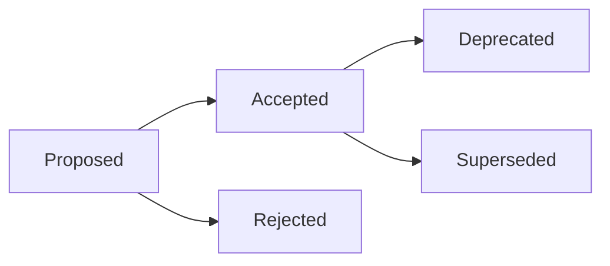

# Architecture Decision Records (ADR)

## 📋 ARCHITECTURE DECISION RECORDS (ADR) OVERVIEW

### **What are ADRs?**
Architecture Decision Records (ADRs) are lightweight documents that capture important architectural decisions made during a project's development. They provide context, reasoning, and consequences for future developers and stakeholders.

### **Why Use ADRs?**
- **Historical context**: Understand why decisions were made
- **Knowledge preservation**: Retain institutional knowledge  
- **Decision reversal**: Provide basis for changing decisions later
- **Team alignment**: Ensure everyone understands architectural choices
- **Onboarding**: Help new team members understand system design
- **Compliance**: Meet regulatory requirements for decision documentation

---

## 🎯 WHEN TO CREATE ADR (MANDATORY)

### **Technology Choices**
Document decisions about major technology selections:
- **Database selection** (PostgreSQL vs MongoDB vs Redis)
- **Framework choices** (React vs Vue vs Angular)
- **Cloud provider** (AWS vs Azure vs Google Cloud)
- **Programming language** for new services
- **Third-party service integrations**

### **Architecture Patterns** 
Document significant architectural decisions:
- **Microservices vs Monolith** architecture
- **Event-driven vs Request-response** patterns
- **Authentication/authorization** strategies  
- **Caching strategies** and technologies
- **API design patterns** (REST vs GraphQL vs gRPC)

### **Major Refactoring**
Document decisions for significant code restructuring:
- **Database schema changes** affecting multiple services
- **Breaking API changes** and migration strategies
- **Legacy system modernization** approaches
- **Performance optimization** strategies

### **Security Implementations**
Document security-related architectural decisions:
- **Encryption strategies** for data at rest and in transit
- **Access control models** (RBAC vs ABAC)
- **Security boundaries** between services
- **Compliance requirements** implementation

### **Performance & Scalability**
Document decisions impacting system performance:
- **Load balancing strategies**
- **Database scaling** approaches (sharding, read replicas)
- **Caching layers** and invalidation strategies
- **CDN implementation** decisions

---

## 📝 ADR TEMPLATE (MANDATORY FORMAT)

### **Required ADR Structure**
Every ADR must follow this exact template:

```markdown
# ADR-[NUMBER]: [TITLE]

## Status
[Proposed | Accepted | Deprecated | Superseded by ADR-XXX]

## Date
[YYYY-MM-DD when decision was made]

## Context
What is the issue that we're addressing? What factors are driving the need for this decision?

### Background
- Current situation description
- Problems with existing approach (if applicable)
- Business/technical drivers for change
- Constraints we're operating under

### Requirements
- Functional requirements
- Non-functional requirements (performance, security, etc.)
- Compliance or regulatory requirements
- Business constraints (budget, timeline, etc.)

## Decision
What is the change that we're proposing and why?

### Chosen Solution
Detailed description of the selected approach

### Key Factors in Decision
- Technical factors that influenced the choice
- Business factors that influenced the choice
- Risk factors considered

## Alternatives Considered
What other options were evaluated?

### Option A: [Name]
- **Description**: Brief overview
- **Pros**: Benefits of this approach
- **Cons**: Drawbacks and limitations  
- **Why Rejected**: Specific reasons for not choosing

### Option B: [Name]
- **Description**: Brief overview
- **Pros**: Benefits of this approach
- **Cons**: Drawbacks and limitations
- **Why Rejected**: Specific reasons for not choosing

### Option C: [Name]
- **Description**: Brief overview
- **Pros**: Benefits of this approach
- **Cons**: Drawbacks and limitations
- **Why Rejected**: Specific reasons for not choosing

## Consequences
What are the positive and negative outcomes of this decision?

### Positive Outcomes
- Benefits we expect to realize
- Problems this decision solves
- Capabilities this enables

### Negative Trade-offs
- Costs or limitations introduced
- Technical debt incurred
- Complexity added

### Risks and Mitigation
- **Risk**: Potential issue that could arise
  - **Likelihood**: High/Medium/Low
  - **Impact**: High/Medium/Low  
  - **Mitigation**: How we'll address this risk

## Implementation Plan
How will this decision be implemented?

### Phase 1: [Timeline]
- Specific tasks and deliverables
- Success criteria
- Dependencies

### Phase 2: [Timeline] 
- Specific tasks and deliverables
- Success criteria
- Dependencies

## Monitoring and Review
How will we measure success and when will we revisit?

### Success Metrics
- Key performance indicators
- How metrics will be measured
- Target values or thresholds

### Review Schedule
- Next review date
- Triggers for early review
- Who is responsible for review

## References
- Links to relevant documentation
- Research papers or blog posts consulted
- Similar decisions in other organizations
- Vendor documentation or comparisons
```

---

## 📚 ADR EXAMPLES

### **Example 1: Database Selection**

```markdown
# ADR-001: Database Selection for User Management Service

## Status
Accepted

## Date
2025-01-06

## Context
We need to select a database technology for our new user management service that will handle authentication, user profiles, and permissions for our application.

### Background
- Starting a new microservice that needs to store user data
- Expected to handle 100,000+ users within first year
- Need ACID compliance for financial transactions
- Team has more experience with SQL than NoSQL
- Strong consistency requirements for user permissions

### Requirements
- Handle 10,000 concurrent users
- 99.9% availability requirement
- GDPR compliance for user data
- Integration with existing monitoring stack
- Budget constraint: $500/month for database hosting

## Decision
We will use PostgreSQL as our primary database for the user management service.

### Chosen Solution
PostgreSQL 14 hosted on AWS RDS with read replicas for scaling read operations.

### Key Factors in Decision
- ACID compliance ensures data consistency
- Excellent JSON support for flexible user profiles
- Strong ecosystem and tooling support
- Team expertise in SQL and PostgreSQL
- Cost-effective at our scale

## Alternatives Considered

### Option A: MongoDB
- **Description**: Document-based NoSQL database
- **Pros**: Flexible schema, good JSON support, horizontal scaling
- **Cons**: Eventual consistency, team lacks NoSQL experience
- **Why Rejected**: Team expertise and consistency requirements favor SQL

### Option B: DynamoDB
- **Description**: AWS-managed NoSQL database
- **Pros**: Serverless, highly scalable, AWS integration
- **Cons**: Vendor lock-in, complex pricing, eventual consistency
- **Why Rejected**: Cost unpredictability and consistency requirements

### Option C: MySQL
- **Description**: Traditional relational database
- **Pros**: Team familiar, proven at scale, many hosting options
- **Cons**: Limited JSON support, less advanced features than PostgreSQL
- **Why Rejected**: PostgreSQL offers better JSON support and advanced features

## Consequences

### Positive Outcomes
- Strong consistency guarantees for user data
- Excellent JSON support for flexible user profiles
- Rich query capabilities with SQL
- Strong backup and recovery options
- Good performance characteristics

### Negative Trade-offs
- Vertical scaling limitations compared to NoSQL
- More complex to shard if horizontal scaling needed
- Requires careful index management for performance

### Risks and Mitigation
- **Risk**: Performance degradation at scale
  - **Likelihood**: Medium
  - **Impact**: High
  - **Mitigation**: Implement read replicas, connection pooling, and query optimization

- **Risk**: Single point of failure
  - **Likelihood**: Low  
  - **Impact**: High
  - **Mitigation**: Use RDS Multi-AZ deployment with automated failover

## Implementation Plan

### Phase 1: Setup (Week 1-2)
- Provision PostgreSQL RDS instance
- Set up database schema and migrations
- Configure connection pooling
- Implement monitoring and alerting

### Phase 2: Integration (Week 3-4)
- Integrate with user service application
- Implement read replicas for scaling
- Set up backup and recovery procedures
- Load testing and performance optimization

## Monitoring and Review

### Success Metrics
- Query response time < 100ms (95th percentile)
- Database availability > 99.9%
- Successful failover within 30 seconds
- Zero data loss during failures

### Review Schedule
- Next review: 2025-07-06 (6 months)
- Early review triggers: Performance issues, scaling challenges
- Responsible: Database Team Lead

## References
- [PostgreSQL vs MongoDB Comparison](https://example.com/comparison)
- [AWS RDS PostgreSQL Documentation](https://docs.aws.amazon.com/rds/)
- [PostgreSQL JSON Performance Study](https://example.com/json-study)
```

### **Example 2: API Design Pattern**

```markdown
# ADR-002: API Design Pattern for External Integrations

## Status
Accepted

## Date
2025-01-06

## Context
We need to decide on an API design pattern for external partner integrations and public APIs.

### Background
- Building APIs for third-party partner integrations
- Need to support mobile applications and web clients
- Partners have varying technical capabilities
- Need to maintain backward compatibility
- Expecting high traffic volume (10,000+ requests/minute)

### Requirements
- Easy to understand and implement for partners
- Support for real-time data when needed
- Efficient bandwidth usage for mobile clients
- Strong typing and documentation
- Version management and backward compatibility

## Decision
We will implement a RESTful API design with GraphQL available for advanced use cases.

### Chosen Solution
- Primary REST API following OpenAPI 3.0 specification
- GraphQL endpoint available for complex queries
- JSON-based request/response format
- Standard HTTP status codes and error handling

### Key Factors in Decision
- REST is widely understood by integration partners
- GraphQL provides efficiency for complex data fetching
- Standard HTTP semantics reduce learning curve
- Excellent tooling ecosystem for both patterns

## Alternatives Considered

### Option A: GraphQL Only
- **Description**: Single GraphQL endpoint for all operations
- **Pros**: Efficient data fetching, strongly typed, single endpoint
- **Cons**: Learning curve for partners, complex caching, harder to debug
- **Why Rejected**: Too complex for simple partner integrations

### Option B: gRPC
- **Description**: High-performance RPC framework
- **Pros**: Type safety, efficient serialization, streaming support
- **Cons**: HTTP/2 requirement, limited browser support, learning curve
- **Why Rejected**: Browser compatibility and partner adoption challenges

### Option C: REST Only
- **Description**: Pure RESTful API design
- **Pros**: Universal understanding, simple implementation, great tooling
- **Cons**: Over-fetching data, multiple requests for complex data
- **Why Rejected**: Inefficient for mobile clients with complex data needs

## Consequences

### Positive Outcomes
- Easy adoption by partners with REST experience
- Efficient data fetching with GraphQL for advanced use cases
- Standard HTTP semantics and status codes
- Excellent documentation and tooling support

### Negative Trade-offs
- Need to maintain both REST and GraphQL schemas
- Additional complexity in implementation
- Potential confusion about when to use which API

### Risks and Mitigation
- **Risk**: Schema drift between REST and GraphQL
  - **Likelihood**: Medium
  - **Impact**: Medium
  - **Mitigation**: Automated schema validation and shared data models

- **Risk**: Performance issues with complex GraphQL queries
  - **Likelihood**: Medium
  - **Impact**: High
  - **Mitigation**: Query complexity analysis and rate limiting

## Implementation Plan

### Phase 1: REST Foundation (Week 1-4)
- Design core REST API endpoints
- Implement authentication and rate limiting
- Create OpenAPI documentation
- Set up automated testing

### Phase 2: GraphQL Layer (Week 5-8)
- Design GraphQL schema
- Implement resolvers and data loaders
- Add query complexity analysis
- Create GraphQL playground and documentation

## Monitoring and Review

### Success Metrics
- Partner adoption rate > 80% within 6 months
- API response time < 200ms (95th percentile)
- Error rate < 0.1%
- Partner satisfaction score > 4.0/5.0

### Review Schedule
- Next review: 2025-07-06 (6 months)
- Early review triggers: Performance issues, partner feedback
- Responsible: API Team Lead

## References
- [REST API Design Best Practices](https://example.com/rest-best-practices)
- [GraphQL Best Practices](https://graphql.org/learn/best-practices/)
- [OpenAPI 3.0 Specification](https://swagger.io/specification/)
```

---

## 📁 ADR ORGANIZATION

### **File Naming Convention**
```
docs/architecture/decisions/
├── ADR-001-database-selection-user-service.md
├── ADR-002-api-design-pattern-external-integrations.md  
├── ADR-003-authentication-strategy-microservices.md
├── ADR-004-caching-implementation-performance.md
└── README.md  # Index of all ADRs
```

### **Numbering System**
- Use sequential numbers: ADR-001, ADR-002, etc.
- Never reuse numbers, even for deprecated ADRs
- Maintain chronological order by number

### **ADR Index (README.md)**
```markdown
# Architecture Decision Records

## Active ADRs
- [ADR-001: Database Selection for User Service](ADR-001-database-selection-user-service.md) - Accepted
- [ADR-002: API Design Pattern](ADR-002-api-design-pattern-external-integrations.md) - Accepted  
- [ADR-003: Authentication Strategy](ADR-003-authentication-strategy-microservices.md) - Proposed

## Deprecated ADRs  
- [ADR-004: Legacy Caching Implementation](ADR-004-caching-implementation-performance.md) - Superseded by ADR-007

## Status Summary
- **Proposed**: 1
- **Accepted**: 2  
- **Deprecated**: 1
- **Total**: 4
```

---

## 🔄 ADR LIFECYCLE MANAGEMENT

### **Status Transitions**


### **Status Definitions**
- **Proposed**: Decision is under consideration
- **Accepted**: Decision has been approved and implemented
- **Rejected**: Decision was considered but not accepted  
- **Deprecated**: Decision is no longer recommended but may still be in use
- **Superseded**: Decision has been replaced by a newer ADR

### **Review Process**
```typescript
interface ADRReview {
  reviewDate: Date;
  reviewers: string[];
  status: 'approved' | 'needs-changes' | 'rejected';
  feedback: string[];
  nextReviewDate?: Date;
}

// ADR review checklist
const ADR_REVIEW_CHECKLIST = [
  'Problem statement is clear and well-defined',
  'Context provides sufficient background information',
  'Multiple alternatives were considered',
  'Decision rationale is well-justified',
  'Consequences are realistic and comprehensive',
  'Implementation plan is feasible',
  'Success metrics are measurable',
  'Document follows ADR template exactly'
];
```

---

## 🛠️ ADR TOOLING AND AUTOMATION

### **ADR Creation Script**
```bash
#!/bin/bash
# scripts/create-adr.sh

# Get next ADR number
NEXT_NUM=$(find docs/architecture/decisions -name "ADR-*.md" | wc -l | awk '{print $1+1}')
PADDED_NUM=$(printf "%03d" $NEXT_NUM)

# Get title from user
echo "Enter ADR title:"
read TITLE

# Convert title to filename
FILENAME="ADR-${PADDED_NUM}-$(echo $TITLE | sed 's/ /-/g' | tr '[:upper:]' '[:lower:]').md"

# Create ADR from template
cat > "docs/architecture/decisions/${FILENAME}" << EOF
# ADR-${PADDED_NUM}: ${TITLE}

## Status
Proposed

## Date
$(date +%Y-%m-%d)

## Context
[Describe the issue that we're addressing]

### Background
[Current situation and problems]

### Requirements  
[Functional and non-functional requirements]

## Decision
[What is the change that we're proposing and why?]

### Chosen Solution
[Detailed description of the selected approach]

### Key Factors in Decision
[Technical and business factors]

## Alternatives Considered

### Option A: [Name]
- **Description**: 
- **Pros**: 
- **Cons**: 
- **Why Rejected**: 

## Consequences

### Positive Outcomes
[Benefits we expect to realize]

### Negative Trade-offs
[Costs or limitations introduced]

### Risks and Mitigation
[Potential risks and how to address them]

## Implementation Plan
[How will this decision be implemented?]

## Monitoring and Review
[How will we measure success?]

### Success Metrics
[Key performance indicators]

### Review Schedule  
- Next review: $(date -d "+6 months" +%Y-%m-%d)
- Responsible: [Team/Person]

## References
[Links to relevant documentation]
EOF

echo "Created ADR: ${FILENAME}"
echo "Please fill in the template and submit for review."
```

### **ADR Validation Script**
```bash
#!/bin/bash
# scripts/validate-adr.sh

ADR_FILE=$1

# Check required sections exist
REQUIRED_SECTIONS=(
  "## Status"
  "## Date" 
  "## Context"
  "## Decision"
  "## Alternatives Considered"
  "## Consequences"
  "## Implementation Plan"
  "## Monitoring and Review"
)

for section in "${REQUIRED_SECTIONS[@]}"; do
  if ! grep -q "$section" "$ADR_FILE"; then
    echo "❌ Missing required section: $section"
    exit 1
  fi
done

echo "✅ ADR validation passed"
```

---

## 📊 ADR METRICS AND REPORTING

### **Track ADR Effectiveness**
```typescript
interface ADRMetrics {
  totalADRs: number;
  adrsCreatedThisQuarter: number;
  averageImplementationTime: number; // days
  adrsUnderReview: number;
  adrsNeedingUpdate: number;
  teamCompliance: number; // % of decisions documented
}

// Generate ADR compliance report
function generateADRReport(): ADRMetrics {
  const adrFiles = findADRFiles();
  const recentADRs = adrFiles.filter(isCreatedThisQuarter);
  const reviewNeeded = adrFiles.filter(needsReview);
  
  return {
    totalADRs: adrFiles.length,
    adrsCreatedThisQuarter: recentADRs.length,
    averageImplementationTime: calculateAverageImplementationTime(adrFiles),
    adrsUnderReview: adrFiles.filter(adr => adr.status === 'Proposed').length,
    adrsNeedingUpdate: reviewNeeded.length,
    teamCompliance: calculateTeamCompliance()
  };
}
```

---

## 📋 ADR PROCESS CHECKLIST

### **Before Creating ADR**
- [ ] Decision impacts system architecture significantly
- [ ] Multiple solutions were evaluated  
- [ ] Stakeholders have been consulted
- [ ] Technical research has been completed
- [ ] Business requirements are understood

### **ADR Creation Process**
- [ ] Use standard ADR template
- [ ] Include all required sections
- [ ] Provide clear problem statement
- [ ] Document at least 3 alternatives considered
- [ ] Include realistic consequences assessment
- [ ] Define measurable success criteria
- [ ] Set review schedule

### **ADR Review Process**
- [ ] Technical review by architecture team
- [ ] Business stakeholder approval
- [ ] Security review (if applicable)
- [ ] Performance impact assessment
- [ ] Documentation quality check
- [ ] Implementation feasibility validation

### **Post-Implementation**
- [ ] Update ADR status to "Accepted"
- [ ] Monitor defined success metrics
- [ ] Schedule regular reviews
- [ ] Update documentation as needed
- [ ] Communicate decisions to affected teams

---

## 🚨 ADR ENFORCEMENT RULES

### **Mandatory ADR Creation**
The following decisions REQUIRE an ADR:
- Technology selection affecting multiple teams
- Architecture patterns with system-wide impact
- Breaking changes to public APIs
- Security model changes
- Data storage strategy changes
- Third-party service integrations
- Compliance-related implementations

### **ADR Quality Gates**
- All ADRs must pass validation script
- Minimum 2 reviewers required for approval
- Architecture team sign-off required
- Implementation plan must be realistic
- Success metrics must be measurable

### **Consequences of Non-Compliance**
- Code reviews will reject changes without supporting ADR
- Architecture review board escalation
- Delayed deployment approvals
- Technical debt tracking and remediation

---

**Related Rules**: See `core-standards/core-workflow.md` for documentation requirements and `general-policies/ops/git-workflow.md` for ADR change management process.