# 🚀 High ROI Feature Development with Playwright-First Approach

**Maximize feature impact with minimal Lines of Code (LoC) through user-flow driven development**

## 🎯 CORE PRINCIPLE: Maximum Value, Minimum Code

### **The ROI Formula:**
```
ROI = (User Value × Test Coverage × Feature Completeness) / Lines of Code Changed
```

### **Decision Matrix:**
Before ANY feature development, score each approach:
- **User Impact**: 1-10 (How many users benefit?)
- **Business Value**: 1-10 (Revenue/efficiency impact?)
- **Code Complexity**: 1-10 (Lower is better)
- **Test Coverage**: 1-10 (Can Playwright verify this?)
- **Reusability**: 1-10 (Can other features use this?)

**Proceed only if: (User Impact + Business Value + Test Coverage + Reusability) / Code Complexity > 3**

## 📋 MANDATORY PLAYWRIGHT-FIRST WORKFLOW

### **Step 1: Write the E2E Test FIRST (Not the Code)**
```typescript
// ALWAYS START HERE - Write the user journey test first
test('user can complete [feature]', async ({ page }) => {
  // 1. Define the user journey
  await page.goto('/feature-entry-point');
  
  // 2. Document expected interactions
  await page.getByRole('button', { name: 'Start Feature' }).click();
  
  // 3. Define success criteria
  await expect(page.getByText('Success')).toBeVisible();
  
  // 4. Capture the success state
  await page.screenshot({ path: 'feature-success.png' });
});
```

### **Step 2: Identify Minimum Implementation Path**
After writing the test, identify:
1. **Existing components to reuse** (0 new LoC)
2. **Existing patterns to copy** (minimal new LoC)
3. **Existing utilities to leverage** (minimal new LoC)
4. **Only then**: New code needed

## 🔧 HIGH ROI IMPLEMENTATION PATTERNS

### **Pattern 1: Component Composition Over Creation**
```typescript
// ❌ BAD: Creating new component (50+ LoC)
const CustomDataTable = () => { /* ... */ };

// ✅ GOOD: Composing existing components (5 LoC)
const FeatureView = () => (
  <ExistingTable 
    data={useExistingHook()} 
    columns={existingColumns}
  />
);
```

### **Pattern 2: Configuration Over Code**
```typescript
// ❌ BAD: New validation logic (30+ LoC)
const validateCustomField = (value) => { /* ... */ };

// ✅ GOOD: Configure existing validation (3 LoC)
const config = {
  field: { validate: 'email|required|min:5' }
};
```

### **Pattern 3: Event Delegation Over Individual Handlers**
```typescript
// ❌ BAD: Multiple event handlers (20+ LoC per handler)
<Button onClick={handleClick1} />
<Button onClick={handleClick2} />

// ✅ GOOD: Single delegated handler (5 LoC total)
<div onClick={(e) => handleAction(e.target.dataset.action)}>
  <Button data-action="action1" />
  <Button data-action="action2" />
</div>
```

## 📊 USER FLOW CATEGORIES (From E2E Analysis)

### **Critical User Flows (MUST HAVE E2E Tests)**
1. **Authentication Flow**
   - Login → Dashboard → Logout
   - Session persistence
   - Role-based access

2. **Data Management Flow**
   - List → Filter → Select → Edit → Save
   - Validation → Error handling → Success

3. **Dashboard Interaction Flow**
   - Load → Interact with widgets → Update data
   - Responsive behavior → Real-time updates

4. **Navigation Flow**
   - Menu → Route → Content → Back
   - Deep linking → State preservation

### **High-Value Interaction Patterns**
```typescript
// Reusable interaction patterns from E2E tests
const patterns = {
  formSubmission: 'fill → validate → submit → confirm',
  dataRefresh: 'click refresh → loading state → updated data',
  modalFlow: 'open → interact → save/cancel → close',
  searchFilter: 'type → debounce → results → select',
};
```

## 🎭 PLAYWRIGHT TEST TEMPLATES

### **Template 1: Feature Toggle Test**
```typescript
test('feature flag enables new functionality', async ({ page }) => {
  // Minimal code: Just add flag check
  await page.goto('/settings');
  await page.getByLabel('Enable Feature X').check();
  await page.goto('/feature-x');
  await expect(page.getByTestId('feature-x')).toBeVisible();
});
```

### **Template 2: Progressive Enhancement Test**
```typescript
test('feature works without JavaScript', async ({ browser }) => {
  // Test core functionality works even with JS disabled
  const context = await browser.newContext({ javaScriptEnabled: false });
  const page = await context.newPage();
  await page.goto('/feature');
  // Core functionality should still work
  await expect(page.getByText('Content')).toBeVisible();
});
```

### **Template 3: Visual Regression Prevention**
```typescript
test('feature maintains visual consistency', async ({ page }) => {
  await page.goto('/feature');
  // Compare against baseline - prevents visual breaks
  await expect(page).toHaveScreenshot('feature-baseline.png', {
    maxDiffPixels: 100, // Allows minor changes
  });
});
```

## 📈 ROI METRICS & MONITORING

### **Track These Metrics:**
```javascript
const metrics = {
  linesAdded: 0,        // Target: < 250 for small features
  linesDeleted: 0,      // Good if > 0 (refactoring)
  componentsReused: 0,  // Target: > 60%
  newDependencies: 0,   // Target: 0-1 max
  testCoverage: 0,      // Target: 100% for user flows
  playwrightTests: 0,   // Target: 1+ per user flow
};
```

### **Feature Complexity Budget:**
- **Micro Feature**: < 50 LoC (e.g., toggle, config change)
- **Small Feature**: 50-250 LoC (e.g., new form, data view)
- **Medium Feature**: 250-500 LoC (e.g., workflow, dashboard)
- **Large Feature**: 500-1000 LoC (needs justification)
- **Epic**: > 1000 LoC - STOP - Break it down!

## 🛠️ IMPLEMENTATION CHECKLIST

### **Before Starting ANY Feature:**
- [ ] E2E test written and failing
- [ ] User flow documented with screenshots
- [ ] Existing components inventory completed
- [ ] ROI score calculated and > 3
- [ ] Complexity budget defined

### **During Implementation:**
- [ ] Following existing patterns (not creating new ones)
- [ ] Reusing existing utilities
- [ ] Composing existing components
- [ ] No new dependencies added
- [ ] E2E test passing incrementally

### **Before Marking Complete:**
- [ ] All E2E tests passing
- [ ] Visual regression tests passing
- [ ] LoC count within budget
- [ ] No console errors in browser
- [ ] Performance metrics maintained

## 🚫 ANTI-PATTERNS TO AVOID

### **Code Smells That Reduce ROI:**
1. **Creating new components when existing ones work**
2. **Writing custom validation/formatting logic**
3. **Adding new state management patterns**
4. **Implementing custom styling systems**
5. **Building new data fetching mechanisms**
6. **Creating feature-specific utilities**
7. **Writing imperative code over declarative**
8. **Adding new build/config complexity**

## 🎯 QUICK DECISION FRAMEWORK

### **Should I Build This Feature?**

```mermaid
graph TD
    A[New Feature Request] --> B{Can E2E test it?}
    B -->|No| C[Reject/Redesign]
    B -->|Yes| D{Existing components work?}
    D -->|No| E{< 250 LoC?}
    E -->|No| C
    E -->|Yes| F[Proceed with Caution]
    D -->|Yes| G{< 100 LoC?}
    G -->|No| F
    G -->|Yes| H[✅ High ROI - Build It!]
```


## 🔄 CONTINUOUS IMPROVEMENT

### **After Each Feature:**
1. **Measure actual LoC vs estimate**
2. **Count Playwright tests added**
3. **Calculate time to implement**
4. **Document patterns for reuse**
5. **Update component library**

### **Weekly Review Questions:**
- Which features had highest ROI?
- What patterns emerged for reuse?
- Which E2E tests caught issues?
- Where did we exceed LoC budget?
- What can be refactored for reuse?

## 📚 REFERENCE EXAMPLES

### **Example 1: High ROI Feature (Search)**
```typescript
// E2E Test (Written First)
test('user can search data', async ({ page }) => {
  await page.goto('/dashboard');
  await page.getByPlaceholder('Search').fill('test');
  await expect(page.getByText('test result')).toBeVisible();
});

// Implementation (~30 LoC including imports/structure)
const SearchFeature = () => {
  const [query, setQuery] = useState('');
  const [debouncedQuery] = useDebounce(query, 300);
  const { data, loading } = useExistingDataHook();
  
  const filtered = useMemo(() => 
    data?.filter(d => 
      d.name.toLowerCase().includes(debouncedQuery.toLowerCase())
    ), [data, debouncedQuery]
  );
  
  return (
    <div>
      <SearchInput 
        value={query}
        onChange={setQuery}
        placeholder="Search..."
      />
      {loading && <Spinner />}
      <ExistingTable data={filtered} />
    </div>
  );
};
```

### **Example 2: Low ROI Feature (Custom Chart)**
```typescript
// ❌ AVOID: Custom implementation (200+ LoC)
// ✅ BETTER: Use existing chart with config (10 LoC)
const chart = {
  type: 'line',
  data: existingDataTransform(data),
  options: existingChartOptions.performance
};
```

## ✅ SUCCESS CRITERIA

**A feature is HIGH ROI when:**
- E2E tests were written first
- Implementation < 250 LoC for new features
- Reuses > 60% existing code
- 0-1 new dependencies maximum
- Playwright can verify all flows
- Visual regression tests pass
- Takes < 1 day to implement
- Benefits significant user base

**Remember: The best code is code you don't write!**